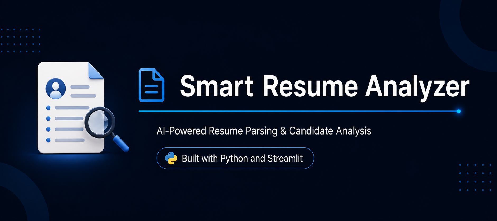
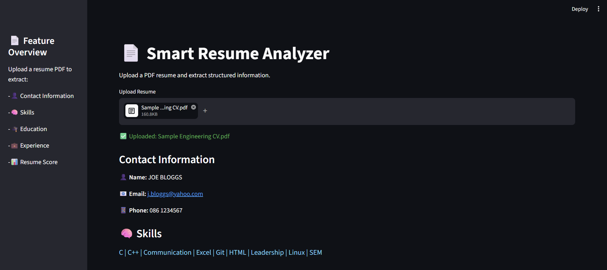
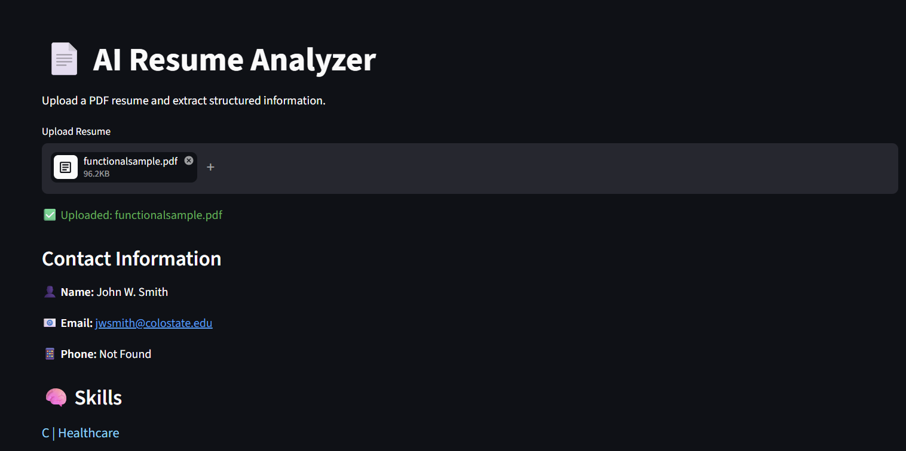
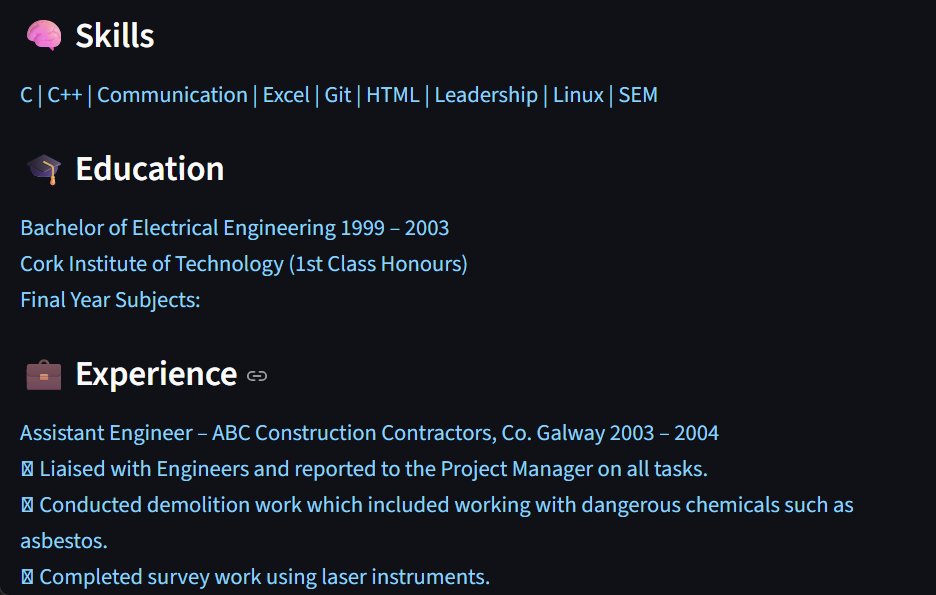
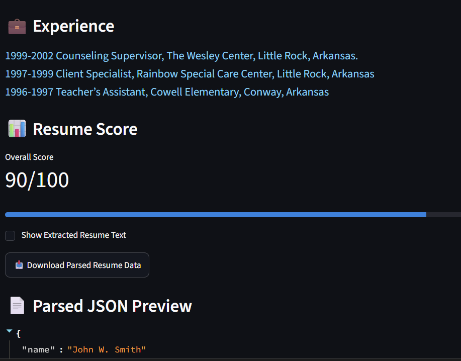

<p align="center">
  
</p>

# 📄 Smart Resume Analyzer


Smart Resume Analyzer is a Python and Streamlit based application that automatically extracts and organizes key information from PDF resumes. The system identifies contact details, skills, education, and work experience, generates a resume score, and exports structured data in JSON format, helping streamline resume screening and candidate evaluation.

## 🎯 Key Highlights

- Upload and analyze PDF resumes
- Extract contact information automatically
- Detect technical skills
- Extract education and experience sections
- Generate resume quality score
- Export parsed data as JSON
- Interactive Streamlit dashboard
  
## 🚀 Features

* 📄 Upload PDF resumes
* 👤 Extract candidate name
* 📧 Extract email address
* 📱 Extract phone number
* 🧠 Detect technical skills
* 🎓 Extract education details
* 💼 Extract work experience
* 📊 Generate a resume score
* 📥 Download parsed resume data as JSON
* 🎨 Interactive and user-friendly dashboard

---

## 🛠️ Tech Stack

* Python
* Streamlit
* PyPDF2
* Regular Expressions (Regex)
* JSON

---

## 📂 Project Structure

```plaintext
ResumeParserProject/
│
├── app.py
├── requirements.txt
├── README.md
│
├── assets/
│   ├── home.png
│   ├── contact.png
│   ├── skills.png
│   └── score.png
│
├── data/
│   └── skills.csv
│   └── experience_keywords.txt
│   └── education_keywords.txt
│
├── uploads/
│
├── sample_resumes/
│
└── utils/
    ├── extract_text.py
    ├── extract_name.py
    ├── extract_contact.py
    ├── extract_skills.py
    ├── extract_education.py
    ├── extract_experience.py
    └── resume_score.py
```

---

## ⚙️ Installation

### Clone the repository

```bash
git clone https://github.com/anshitaagarg/AI-Resume-Analyzer.git
cd ResumeParserProject
```

### Create virtual environment

```bash
python -m venv venv
```

### Activate virtual environment

#### Windows

```bash
venv\Scripts\activate
```

#### Mac/Linux

```bash
source venv/bin/activate
```

### Install dependencies

```bash
pip install -r requirements.txt
```

### Run the application

```bash
streamlit run app.py
```

---

## 📸 Application Screenshots

### Home Page

Add screenshot here



### Contact Information Extraction



### Skills Detection



### Resume Score



---

## 📊 Resume Scoring Criteria

The application evaluates resumes based on:

| Section    | Points |
| ---------- | ------ |
| Name       | 15     |
| Email      | 15     |
| Phone      | 10     |
| Skills     | 25     |
| Education  | 15     |
| Experience | 20     |

**Maximum Score: 100**

---

## 🔮 Future Improvements

* Support DOCX resumes
* AI-based skill extraction using NLP
* Resume-job description matching
* ATS compatibility score
* Resume recommendations
* Cloud deployment
* Advanced analytics dashboard

---

## 🎯 Learning Outcomes

This project helped in understanding:

* PDF text extraction
* Information parsing using Regex
* Data processing with Python
* Streamlit dashboard development
* JSON data handling
* Software project structuring
* UI design and debugging

---

## 👨‍💻 Author

**Anshita**

B.Tech Artificial Intelligence & Machine Learning Student

Built as part of an AI Internship Project.
